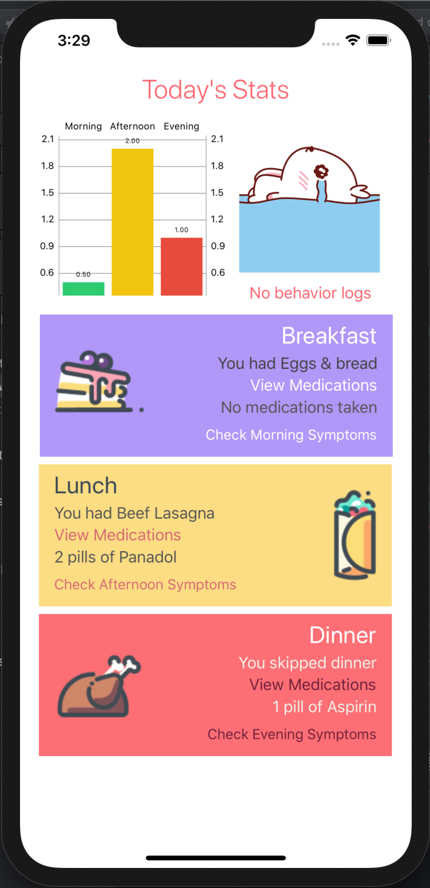

# Tend - HackDavis 2020

## Contributors

* Hajra Mobashar
* Katie Kwak
* Yiping Su
* Joanne Chang

---

## Tend

**Tend** is a healthcare app written in Swift which focuses on a patient's well-being. Our app's goal is
to make it easier for a caregiver and user to keep track of health information.

	

**Tend** uses the following APIs:

* Firebase - database
* Charts - port of Android chart in Swift

## Challenges We Ran Into

One of the challenges we ran into was handling statistical data and displaying it in a user friendly way.

## Accomplishments

We are excited that we built an iOS app using Firebase. We believe that we have learned a lot about Firebase and are excited to use it in future projects.
